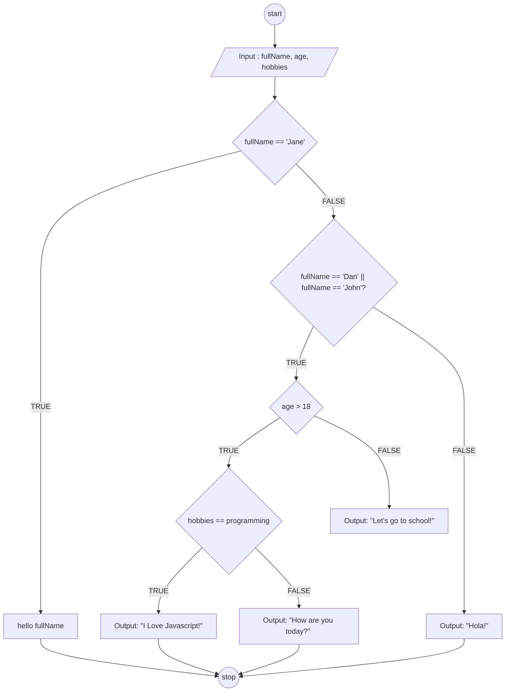

```mermaid
flowchart TD
A@{ shape: circle, label: "start"} --> B

B@{ shape: lean-r, label: "Input : fullName, age, hobbies" } --> C

C@{ shape: diamond, label: "fullName == 'Jane'" } -->|TRUE| D

C -- FALSE --> E

D@{ shape: rect, label: "hello fullName"} 

E@{ shape: diamond, label: "fullName == 'Dan' || fullName == 'John'?" } --> |TRUE| F

E -- FALSE --> K

F@{ shape: diamond, label: "age > 18 "} 

F --> |TRUE| O

F -- FALSE --> H

H@{ shape: rect, label: "Output: \"Let's go to school!\" " } 

K@{ shape: rect, label: "Output: \"Hola!\" " }

O@{ shape: diamond, label: "hobbies == programming" } -->|TRUE| P

O -- FALSE --> Q

P@{ shape: rect, label: "Output: \"I Love Javascript!\" "} 

Q@{ shape: rect, label: "Output: \"How are you today?\" "} 

Z@{ shape: circle, label: "stop" }


D --> Z
K --> Z
Q --> Z 
P --> Z
```
