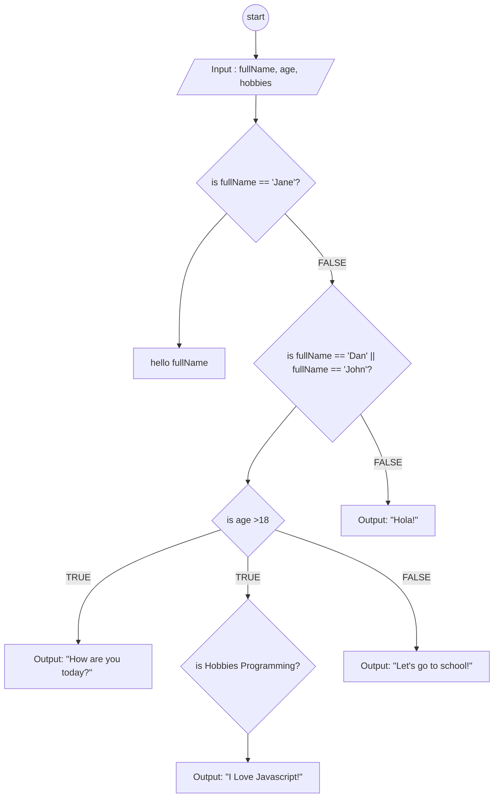

```mermaid
flowchart TD
A@{ shape: circle, label: "start"} --> B

B@{ shape: lean-r, label: "Input : fullName, age, hobbies" } --> C

C@{ shape: diamond, label: "is fullName == 'Jane'?" } --> D

C -- FALSE --> E

D@{ shape: rect, label: "hello fullName"} 

E@{ shape: diamond, label: "is fullName == 'Dan' || fullName == 'John'?" } --> F

E -- FALSE --> K

F@{ shape: diamond, label: "is age >18"} --> |TRUE| G

F -- TRUE --> I

I@{ shape: diamond, label: "is Hobbies Programming?" } --> J

J@{ shape: rect, label: "Output: \"I Love Javascript!\" " }

F -- FALSE --> H

G@{ shape: rect, label: "Output: \"How are you today?\" " }

H@{ shape: rect, label: "Output: \"Let's go to school!\" " } 

K@{ shape: rect, label: "Output: \"Hola!\" " }
```