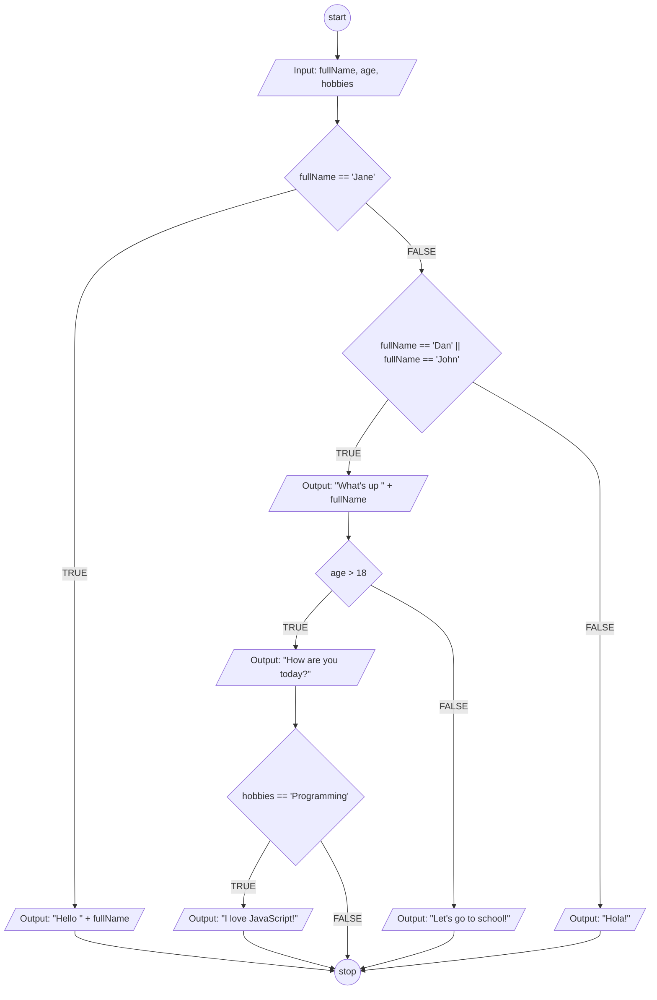

```mermaid
flowchart TD
    A@{ shape: circle, label: "start" } --> B

    B@{ shape: lean-r, label: "Input: fullName, age, hobbies" } --> C

    C@{ shape: diamond, label: "fullName == 'Jane'" } -->|TRUE| D

    C -- FALSE --> E

    D@{ shape: lean-r, label: "Output: \"Hello \" + fullName" } 

    E@{ shape: diamond, label: "fullName == 'Dan' || fullName == 'John'" } 

    E -- TRUE --> S

    S@{ shape: lean-r, label: "Output: \"What's up \" + fullName" } 

    E -- FALSE --> K

    S --> F

    F@{ shape: diamond, label: "age > 18" } 

    F  --> |TRUE| Q

    F -- FALSE --> H

    H@{ shape: lean-r, label: "Output: \"Let's go to school!\"" } 

    K@{ shape: lean-r, label: "Output: \"Hola!\"" } 

    O@{ shape: diamond, label: "hobbies == 'Programming'" } -->|TRUE| P

    O -- FALSE --> Z

    P@{ shape: lean-r, label: "Output: \"I love JavaScript!\"" } 

    Q@{ shape: lean-r, label: "Output: \"How are you today?\"" } --> O

    Z@{ shape: circle, label: "stop" }

    D --> Z
    K --> Z
    P --> Z
    H --> Z
```

