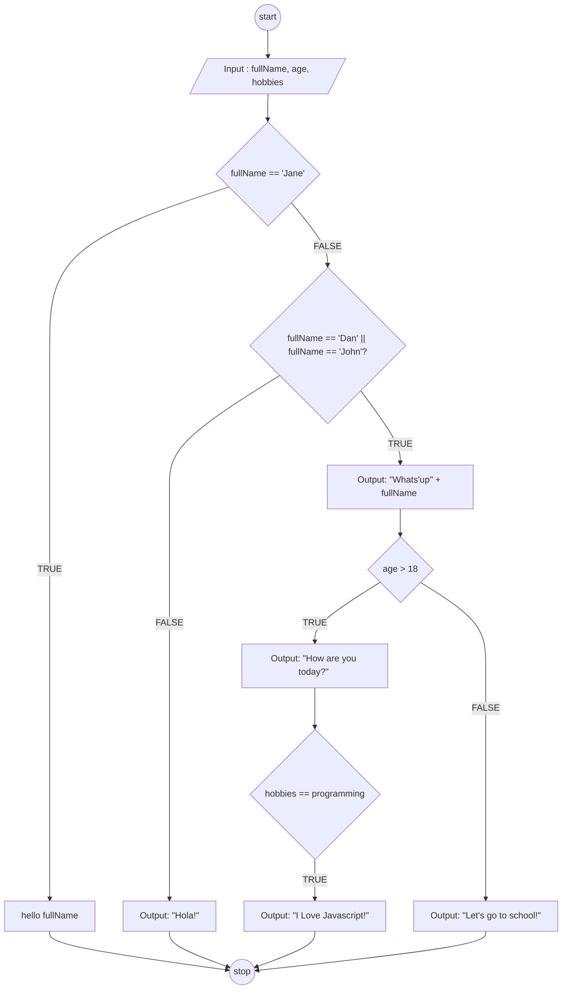

```mermaid
flowchart TD
A@{ shape: circle, label: "start"} --> B

B@{ shape: lean-r, label: "Input : fullName, age, hobbies" } --> C

C@{ shape: diamond, label: "fullName == 'Jane'" } -->|TRUE| D

C -- FALSE --> E

D@{ shape: rect, label: "hello fullName"} 

E@{ shape: diamond, label: "fullName == 'Dan' || fullName == 'John'?" } 

E -- TRUE --> S

S@{ shape: rect, label: "Output: \"Whats'up\" + fullName " }

E -- FALSE --> K

S --> F

F@{ shape: diamond, label: "age > 18 "} 

F  --> |TRUE| Q

F -- FALSE --> H

H@{ shape: rect, label: "Output: \"Let's go to school!\" " } 

K@{ shape: rect, label: "Output: \"Hola!\" " }

O@{ shape: diamond, label: "hobbies == programming" } -->|TRUE| P


P@{ shape: rect, label: "Output: \"I Love Javascript!\" "} 

Q@{ shape: rect, label: "Output: \"How are you today?\" "} --> O

Z@{ shape: circle, label: "stop" }


D --> Z
K --> Z
P --> Z
H --> Z
```
