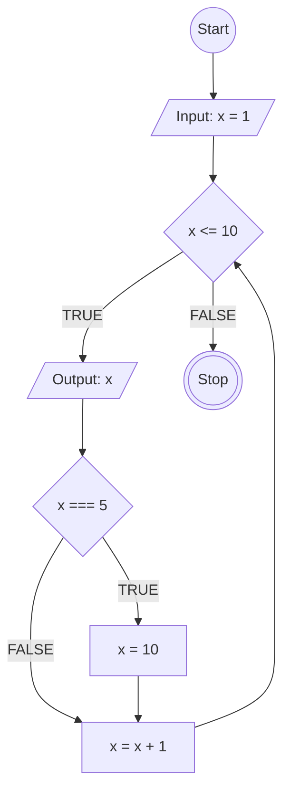
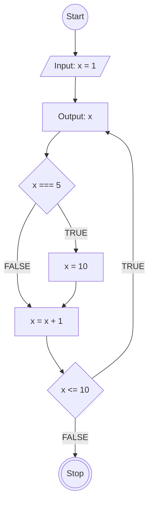

## for loop

```mermaid
flowchart TD

A@{ shape: circle, label: "Start" } --> B

B@{ shape: lean-r, label: "Input: x = 1" } --> C

C@{ shape: diamond, label: "x <= 10" }

D@{ shape: lean-r, label: "Output: x" }

E@{ shape: diamond, label: "x === 5" }

F@{ shape: rect, label: "x = 10" }

G@{ shape: rect, label: "x = x + 1" }

H@{ shape: dbl-circ, label: "Stop" }

C -->|TRUE| D
C -->|FALSE| H

D --> E

E -- "TRUE" --> F
E -- "FALSE" --> G

F --> G
G --> C
```

## do while loop

```mermaid
flowchart TD

A@{ shape: circle, label: "Start" } --> B

B@{ shape: lean-r, label: "Input: x = 1" } --> C

C@{ shape: rect, label: "Output: x" } --> D

D@{ shape: diamond, label: " x === 5" }

E@{ shape: rect, label: "x = 10" }

F@{ shape: rect, label: "x = x + 1" }

G@{ shape: diamond, label: "x <= 10" }

H@{ shape: dbl-circ, label: "Stop" }


D -- "TRUE" --> E
D -- "FALSE" --> F

E --> F
F --> G

G -- "TRUE" --> C
G -- "FALSE" --> H

```

