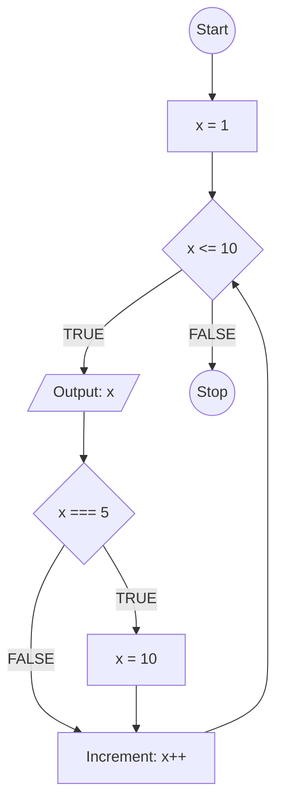

## for loop

```mermaid
flowchart TD

A@{ shape: circle, label: "Start" } --> B

B@{ shape: rect, label: "x = 1" } --> C

C@{ shape: diamond, label: "x <= 10" }

D@{ shape: lean-r, label: "Output: x" }

E@{ shape: diamond, label: "x === 5" }

F@{ shape: rect, label: "x = 10" }

G@{ shape: rect, label: "Increment: x++" }

H@{ shape: circle, label: "Stop" }

C -->|TRUE| D
C -->|FALSE| H

D --> E

E -- "TRUE" --> F
E -- "FALSE" --> G

F --> G
G --> C

```
