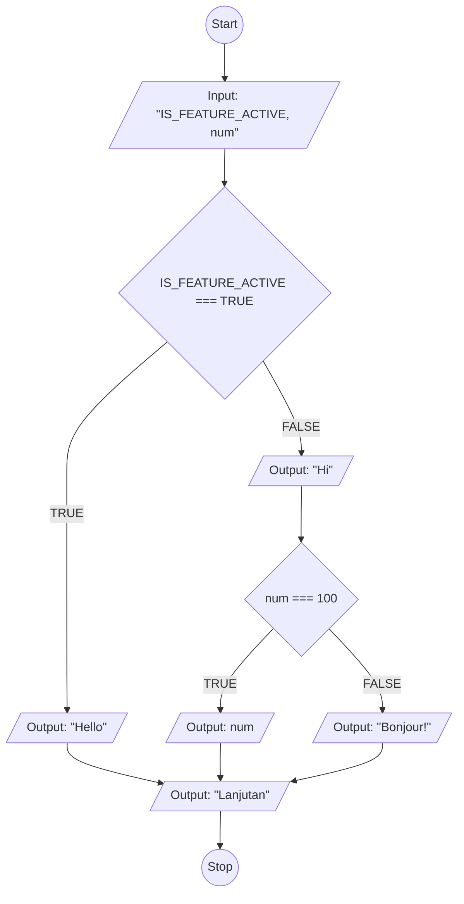

```mermaid
flowchart TD

A@{ shape: circle, label: "Start" } --> B

B@{ shape: lean-r, label: "Input: \"IS_FEATURE_ACTIVE, num\"" }  --> C


C@{ shape: diamond, label: "IS_FEATURE_ACTIVE === TRUE" }

D@{ shape: lean-r, label: "Output: \"Hello\" " }

E@{ shape: lean-r, label: "Output: \"Hi\" " }

F@{ shape: diamond, label: "num === 100" }

G@{ shape: lean-r, label: "Output: num" }

H@{ shape: lean-r, label: "Output: \"Bonjour!\" " }

Z@{ shape: circle, label: "Stop" } 

Y@{ shape: lean-r, label: "Output: \"Lanjutan\" " }


C -- TRUE --> D
C -- FALSE --> E

D --> Y
E --> F

F -- TRUE --> G
F -- FALSE --> H

G --> Y
H --> Y

Y --> Z


```

