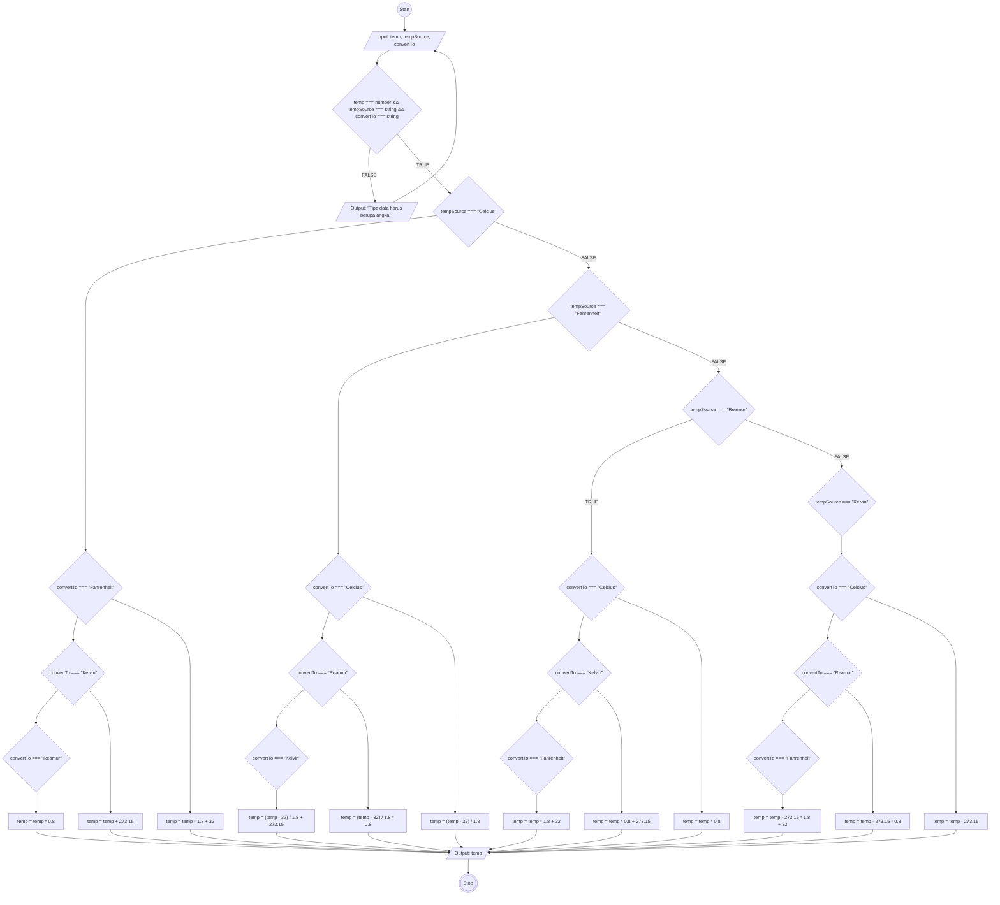

# membuat flowchart

```mermaid
flowchart TD
A@{ shape : circle, label: "Start" } --> B

B@{ shape : lean-r, label: "Input: temp, tempSource, convertTo" } --> C

C@{ shape: diamond, label: "temp === number && tempSource === string && convertTo === string" }

C -- FALSE --> J

C -- TRUE --> D
D --> EA
EA --> EB
EB --> EC

J@{ shape : lean-r, label: "Output: \"Tipe data harus berupa angka!\" "} --> B

D@{ shape : diamond, label: "tempSource === \"Celcius\" " }

D -- FALSE --> F

F@{ shape : diamond, label: "tempSource === \"Fahrenheit\" " } --> FA

FA@{ shape : diamond, label: "convertTo === \"Celcius\" " } 

FB@{ shape : diamond, label: "convertTo === \"Kelvin\" " } 

FC@{ shape : diamond, label: "convertTo === \"Reamur\" " }

FE@{ shape : rect, label: "temp = (temp - 32) / 1.8" } 
FG@{ shape : rect, label: "temp = (temp - 32) / 1.8 + 273.15" } 
FI@{ shape : rect, label: "temp = (temp - 32) / 1.8 * 0.8" }

FA --> FC
FC --> FB
FA --> FE
FB --> FG
FC --> FI

F -- FALSE --> H

H@{ shape : diamond, label: "tempSource === \"Reamur\" " } -- TRUE --> HA

HA@{ shape : diamond, label: "convertTo === \"Celcius\" " } --> HB
HB@{ shape : diamond, label: "convertTo === \"Kelvin\" " } --> HC
HC@{ shape : diamond, label: "convertTo === \"Fahrenheit\" " } 

HE@{ shape : rect, label: "temp = temp * 0.8" }
HG@{ shape : rect, label: "temp = temp * 0.8 + 273.15" }
HI@{ shape : rect, label: "temp = temp * 1.8 + 32" }

HA --> HE
HB --> HG
HC --> HI


H -- FALSE --> N

N@{ shape : diamond, label: "tempSource === \"Kelvin\" " } --> NA

NA@{ shape : diamond, label: "convertTo === \"Celcius\" " } --> NB
NB@{ shape : diamond, label: "convertTo === \"Reamur\" " } --> NC
NC@{ shape : diamond, label: "convertTo === \"Fahrenheit\" " } 

NE@{ shape : rect, label: "temp = temp - 273.15" }
NG@{ shape : rect, label: "temp = temp - 273.15 * 0.8" }
NI@{ shape : rect, label: "temp = temp - 273.15 * 1.8 + 32" }

NA --> NE
NB --> NG
NC --> NI


EA@{ shape : diamond, label: "convertTo === \"Fahrenheit\" " } 

EA --> EE

EB@{ shape : diamond, label: "convertTo === \"Kelvin\" " } 

EC@{ shape : diamond, label: "convertTo === \"Reamur\" " }

EE@{ shape : rect, label: "temp = temp * 1.8 + 32" }
EG@{ shape : rect, label: "temp = temp + 273.15" }
EI@{ shape : rect, label: "temp = temp * 0.8" }


EB --> EG
EC --> EI

EE & EG & EI & FI & FE & FG & HE & HG & HI & NE & NG & NI --> Y

Y@{ shape : lean-r, label: "Output: temp" } --> Z

Z@{ shape: dbl-circ, label: "Stop" }


```
