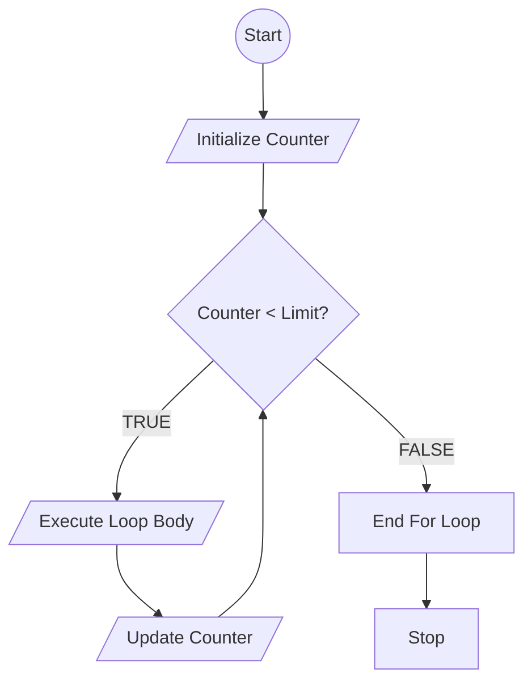
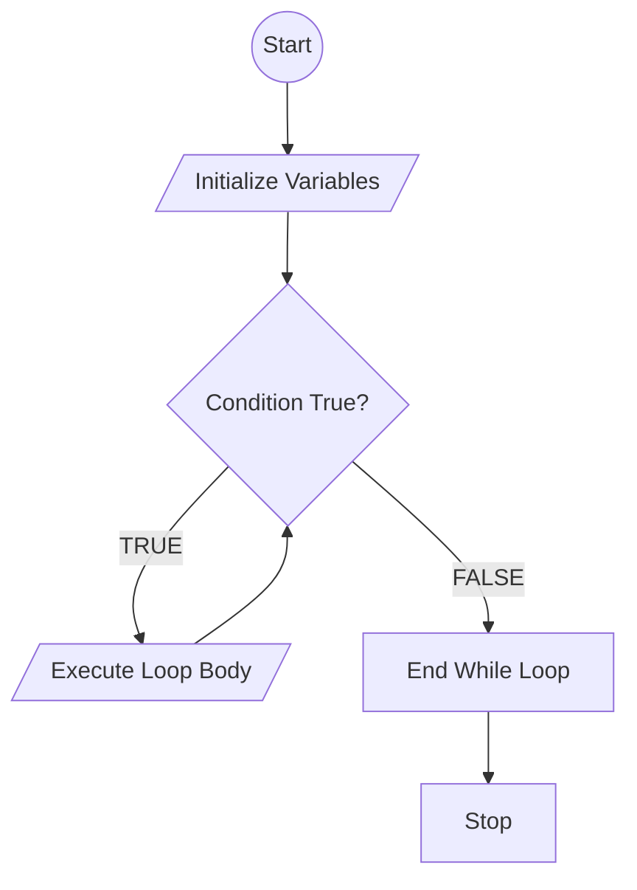
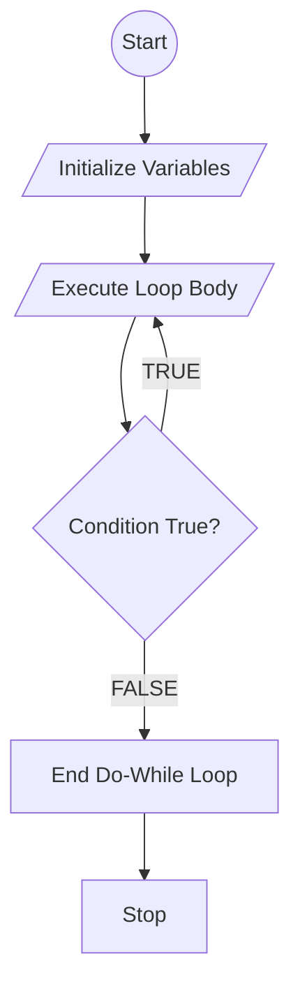

# homework kamis

## nilai truthy dan falsy

Truthy dan falsy merupakan sebuah sebutan bagi nilai non-boolean yang dievaluasi menjadi boolean karena sifat automatic type conversion, atau coersion, dari JavaScript. Nilai truthy merupakan nilai non-boolean yang dievaluasi menjadi nilai true di JavaScript. Sementara nilai falsy merupakan nilai non-boolean yang dievaluasi menjadi nilai false di JavaScript (medium)

## switch case

switch case akan mengeksekusi satu ATAU lebih dari satu ekspresi apabila sesuai dengan kondisi. digunakan sebagai alternatif if..else dalam javascript.

contoh syntax: 

switch(expression) {
  case x:
    // code block
    break;
  case y:
    // code block
    break;
  default:
    // code block
}

break digunakan untuk menghentikan eksekusi program setelah mencapai blok yang sesuai.

