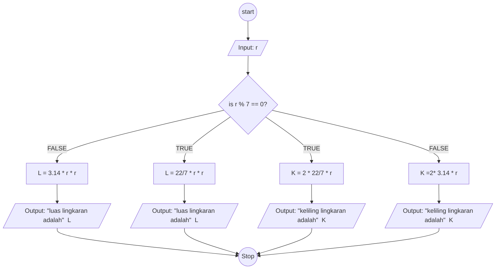

## task 1

```mermaid
flowchart TD

A@{ shape: circle, label: "start"} --> B

B@{ shape: lean-r, label: "Input: r" } --> Z

Z@{ shape: diamond, label: "is r % 7 == 0?"  }

Z -- TRUE --> D
Z -- FALSE --> C

Z -- TRUE --> E
Z -- FALSE --> F

C@{ shape: rect, label: "L = 3.14 * r * r" }

D@{ shape: rect, label: "L = 22/7 * r * r" }

E@{ shape: rect, label: "K = 2 * 22/7 * r" }

F@{ shape: rect, label: "K =2* 3.14 * r" }

K@{ shape: lean-r, label: "Output: \"keliling lingkaran adalah\"  K" }

L@{ shape: lean-r, label: "Output: \"luas lingkaran adalah\"  L" }

M@{ shape: lean-r, label: "Output: \"keliling lingkaran adalah\"  K" }

N@{ shape: lean-r, label: "Output: \"luas lingkaran adalah\"  L" }

C --> L
D --> N
E --> K
F --> M 


J@{ shape: circle, label: "Stop" }

L --> J
N --> J
K --> J
M --> J


```
