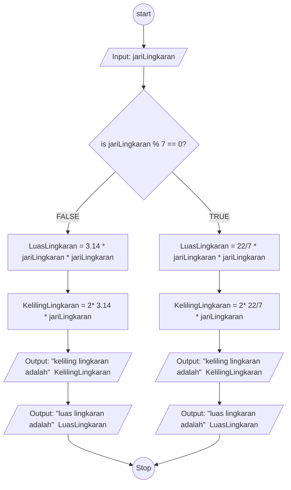

## task 1

```mermaid
flowchart TD

A@{ shape: circle, label: "start"} --> B

B@{ shape: lean-r, label: "Input: jariLingkaran" } --> H

H@{ shape : diamond, label: "is jariLingkaran % 7 == 0?"}

H -- FALSE --> C

H -- TRUE --> U

C@{ shape: rect, label: "LuasLingkaran = 3.14 * jariLingkaran * jariLingkaran" } --> F

F@{ shape: rect, label: "KelilingLingkaran = 2* 3.14 * jariLingkaran" } --> K

U@{ shape: rect, label: "LuasLingkaran = 22/7 * jariLingkaran * jariLingkaran" } --> I

I@{ shape: rect, label: "KelilingLingkaran = 2* 22/7 * jariLingkaran" } --> O

K@{ shape: lean-r, label: "Output: \"keliling lingkaran adalah\"  KelilingLingkaran" } --> L

L@{ shape: lean-r, label: "Output: \"luas lingkaran adalah\"  LuasLingkaran" } --> J

O@{ shape: lean-r, label: "Output: \"keliling lingkaran adalah\"  KelilingLingkaran" }  --> P

P@{ shape: lean-r, label: "Output: \"luas lingkaran adalah\"  LuasLingkaran" } --> J

J@{ shape: circle, label: "Stop" }

```

