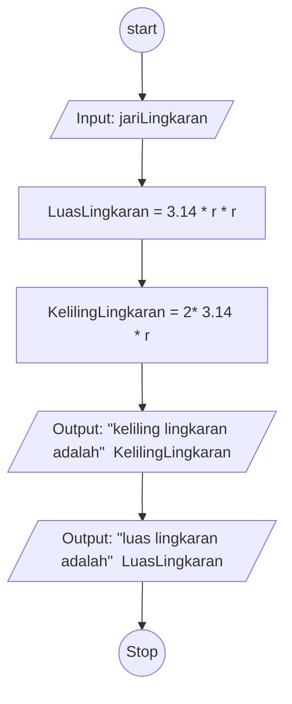

## task 1

```mermaid
flowchart TD

A@{ shape: circle, label: "start"} --> B

B@{ shape: lean-r, label: "Input: jariLingkaran" } --> C


C@{ shape: rect, label: "LuasLingkaran = 3.14 * r * r" } --> F

F@{ shape: rect, label: "KelilingLingkaran = 2* 3.14 * r" } --> K

K@{ shape: lean-r, label: "Output: \"keliling lingkaran adalah\"  KelilingLingkaran" } --> L

L@{ shape: lean-r, label: "Output: \"luas lingkaran adalah\"  LuasLingkaran" } --> J


J@{ shape: circle, label: "Stop" }

```
