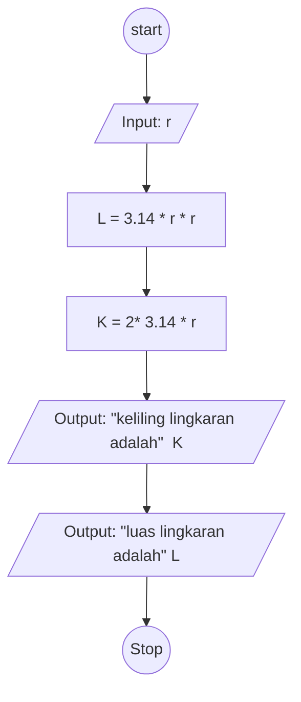

## task 1

```mermaid
flowchart TD

A@{ shape: circle, label: "start"} --> B

B@{ shape: lean-r, label: "Input: r" } --> C


C@{ shape: rect, label: "L = 3.14 * r * r" } --> F

F@{ shape: rect, label: "K = 2* 3.14 * r" } --> K

K@{ shape: lean-r, label: "Output: \"keliling lingkaran adalah\"  K" } --> L

L@{ shape: lean-r, label: "Output: \"luas lingkaran adalah\" L" } --> J


J@{ shape: circle, label: "Stop" }

```

